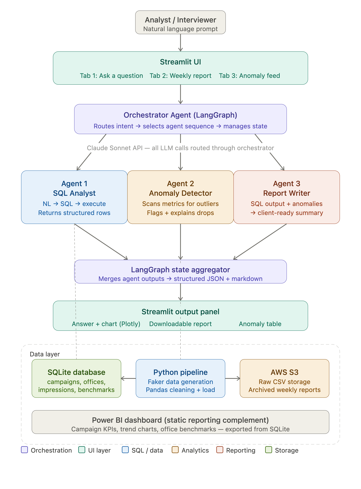

# PatientPoint Campaign Intelligence Agent

> A multi-agent AI system that automates campaign performance reporting, anomaly detection, and ad-hoc data Q&A for point-of-care healthcare media analytics.


---

## What it does

PatientPoint places health education screens in 35,000 physician offices across the US. Their analytics team spends the majority of their week on three manual tasks: pulling SQL reports to answer stakeholder questions, scanning spreadsheets for underperforming campaigns, and writing weekly client summaries for pharma brand partners.

This system automates all three. A data analyst types a business question in plain English and the pipeline handles everything — SQL generation, anomaly detection, and report writing — returning a chart, a flagged anomaly table, or a downloadable client report in under two minutes.

---

## Architecture



The system is built on a LangGraph `StateGraph` that classifies user intent and routes to the correct agent sequence:

```
User prompt → Orchestrator (intent classification) → Agent chain → Streamlit UI

ask_question   → Agent 1 (SQL Analyst)                          → chart / table
show_anomalies → Agent 2 (Anomaly Detector)                     → anomaly feed
run_report     → Agent 1 → Agent 2 → Agent 3 (Report Writer)   → markdown report
```

---

## Features

### Tab 1 — Ask a Question
Type any business question in natural language. Agent 1 uses Claude Haiku to generate SQL, validates it is `SELECT`-only, executes it against 528,999 rows in SQLite, auto-detects the appropriate Plotly chart type (bar, line, table, KPI card), and renders the result with a collapsible SQL block.

### Tab 2 — Weekly Report Generator
Select any campaign and click Generate. A 3-step progress bar tracks each agent as it runs. Agent 1 pulls KPI data, Agent 2 scans for anomalies, Agent 3 calls Claude Sonnet to write a structured client report with executive summary, performance table, anomaly section, and recommendations. The output is downloadable as markdown.

### Tab 3 — Anomaly Feed
Displays the 205 most recent statistical anomalies from a rolling 90-day Z-score baseline. Filter by severity (critical / high / medium) or region. Each row is color-coded and expandable with a plain-English AI explanation generated by Claude Haiku. Export to CSV for client escalation.

### Tab 4 — A/B Significance Tester
Select two campaigns and a date range. Runs Welch's t-test on daily completion rates, shows a box plot overlay and time series comparison, and returns a plain-English verdict with p-value, mean difference, and 95% confidence interval. Pre-seeded campaigns `CAMP_AB_HIGH` (mean 0.71) and `CAMP_AB_LOW` (mean 0.63) always return a statistically significant result for demo purposes.

---

## Tech stack

| Layer | Technology | Purpose |
|---|---|---|
| Orchestration | LangGraph 0.2 | Multi-agent state graph with conditional routing |
| LLM (structured tasks) | Claude Haiku | SQL generation, anomaly explanations |
| LLM (narrative tasks) | Claude Sonnet | Weekly report writing |
| Data simulation | Python Faker + NumPy | 528K row synthetic dataset with seeded anomalies |
| Data processing | Pandas, SciPy | Cleaning pipeline, Z-score baselines, t-tests |
| Storage | SQLite | 6-table schema, 9 indexes, single-file DB |
| UI | Streamlit + Plotly | 4-tab analyst interface with interactive charts |
| Static reporting | Power BI Desktop | 3-page KPI dashboard connected to CSV export |
| Cloud storage | AWS S3 (optional) | Raw CSV versioning and archived report storage |

---

## Setup

### Prerequisites
- Python 3.12
- An Anthropic API key ([get one here](https://console.anthropic.com/settings/keys))
- AWS credentials (optional — the system runs fully offline without them)

### Installation

```bash
# 1. Clone the repo
git clone https://github.com/AaronFChristian/patientpoint-campaign-intelligence.git
cd patientpoint-campaign-intelligence

# 2. Create virtual environment
python -m venv .venv
source .venv/bin/activate        # Windows: .venv\Scripts\activate

# 3. Install dependencies
pip install -r requirements.txt

# 4. Configure environment
cp .env.example .env
# Add your ANTHROPIC_API_KEY to .env
# AWS vars are optional — leave blank to run offline
```

### Generate the dataset

```bash
# Step 1: Generate 528K rows of synthetic campaign data
python data/generate_data.py

# Step 2: Clean and validate
python data/clean_pipeline.py

# Step 3: Load into SQLite
python data/load_sqlite.py
```

### Run the app

```bash
streamlit run app/streamlit_app.py
```

Opens at `http://localhost:8501`.

---

## Sample prompts to try

**Tab 1 — Ask a Question**
```
Which region has the highest average completion rate?
Show me the top 5 campaigns by total impressions
Which specialty has the highest completion rate for cardiovascular campaigns?
Which campaigns are below their KPI target?
How many offices are in each tier?
How does completion rate compare across all 4 regions?
Which health condition has the highest average completion rate?
```

**Tab 2 — Weekly Report**
```
Select CAMP_035 → Generate Report
(Takes ~2 minutes — runs all 3 agents end-to-end)
```

**Tab 4 — A/B Tester**
```
Campaign A: CAMP_AB_HIGH
Campaign B: CAMP_AB_LOW
Date range: Feb 1 2025 → May 1 2025
→ Expect p < 0.001, ~8% performance gap
```

---

## Project structure

```
patientpoint-campaign-intelligence/
│
├── data/
│   ├── generate_data.py          # Faker simulation — 50 campaigns, 5K offices, 528K metric rows
│   ├── clean_pipeline.py         # Pandas cleaning with 22 validation checks
│   └── load_sqlite.py            # SQLite schema creation, bulk insert, 9 indexes
│
├── agents/
│   ├── orchestrator.py           # LangGraph StateGraph — intent classification + routing
│   ├── sql_analyst.py            # Agent 1: NL → SQL → DataFrame, retry on error
│   ├── anomaly_detector.py       # Agent 2: rolling Z-score scan, batch LLM explanations
│   └── report_writer.py          # Agent 3: Sonnet-powered client report writer
│
├── queries/
│   └── ad_hoc_library.sql        # 8 documented business queries (CTEs, window functions)
│
├── app/
│   └── streamlit_app.py          # 4-tab Streamlit UI
│
├── exports/                      # Generated reports saved here (gitignored)
├── powerbi/                      # Power BI .pbix dashboard
│
├── requirements.txt
├── .env.example
├── DECISIONS.md                  # Technical decision rationale
└── README.md
```

---

## Data model

```
campaigns (50)
    └── campaign_placements (8,374) ──── physician_offices (5,000)
            └── daily_metrics (528,999)
            
campaigns (50)
    └── weekly_benchmarks (503)
    
anomaly_log (205)  ← populated by Agent 2 at runtime
```

---

## Key design decisions

See [DECISIONS.md](DECISIONS.md) for full rationale. Summary:

**Claude Haiku for Agents 1 & 2, Sonnet for Agent 3** — SQL generation and anomaly explanation are structured extraction tasks where Haiku is reliable and cost-efficient (~$0.001/run). The weekly report is the only output a pharma client actually reads, so Sonnet's narrative quality earns its cost there.

**Recency filter on anomaly detection** — Z-scores are computed on the full 90-day history, but only anomalies from the last 14 days are surfaced. This is how production alerting systems work — a drop from March is irrelevant on a December dashboard. Without this filter, 7,878 anomalies would hit the API context limit; with it, 205 are flagged and explained in 3 Haiku batches.

**LangGraph over a plain function chain** — Conditional routing means each intent only fires the agents it needs. An ad-hoc question skips Agents 2 and 3 entirely, keeping Tab 1 response time under 5 seconds. The typed `AgentState` schema makes every data handoff explicit and debuggable.

**SQLite over PostgreSQL** — Identical SQL semantics for everything this project does. Zero setup for the reviewer, no running process to manage. Every query in `ad_hoc_library.sql` runs unchanged against Snowflake or BigQuery.

---

## PatientPoint context

This project was built to demonstrate analytical capabilities aligned with PatientPoint's current data strategy. Two relevant moves from 2026:

- **ContentIQ (May 2026)** — PatientPoint's LLM that personalizes waiting room content to specific conditions and specialty types. This project builds the analytics layer that would measure ContentIQ's effectiveness at the office level.
- **Health Audiences (Mar 2026)** — Programmatic ad capability using claims data. The campaign measurement patterns in `ad_hoc_library.sql` (Query 5: regional heatmap, Query 8: executive scorecard) map directly to how Health Audiences performance would be reported to pharma clients.

---

## Author

**Aaron Christian**
MS Information Systems, SDSU (2026) · GPA 3.7
Generative AI Research Assistant

[GitHub](https://github.com/AaronFChristian) · [LinkedIn](https://linkedin.com/in/aaronchristian)
